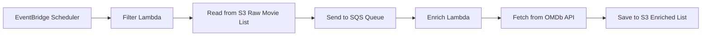

# Movie Enricher

## Introduction

This project provides a serverless solution for filtering and enriching movie data using AWS services. It fetches a list of movies, filters for the top 10, enriches them with additional details from the OMDb API, and stores the results in an S3 bucket. Some of its features are:

* **Serverless Architecture:** Built entirely on AWS Lambda, S3, and SQS for a scalable and cost-effective solution.
* **Automated Data Pipeline:** Fetches, filters, and enriches movie data automatically.
* **Infrastructure as Code:** Uses Sceptre for automated deployment and management of AWS resources.
* **Private Key Handling:** Uses a local `.env` file for local configs and uploads the OMDb API key as a secret to AWS Secrets Manager.
* **Data Transformation in Python**: Having the Data Warehouse concept in mind, the enriched data is structured to be easier to filter and manipulate.

## Architecture Overview

The project is composed of the following AWS services:

* **Amazon S3:** Used for storing the initial movie data, the enriched movie data, and the Lambda function deployment packages.
* **AWS Lambda:** Two Lambda functions are used:
    * **Filter Function:** Fetches the movie list from S3, filters for the top 10 movies based on rank, and sends the filtered list to an SQS queue.
    * **Enrich Function:** Receives the top 10 movies from the SQS queue, fetches additional details for each movie from the OMDb API, and saves the enriched data to another S3 bucket.
* **Amazon SQS:** Used as a message queue to decouple the filter and enrich Lambda functions.
* **AWS IAM:** Provides the necessary permissions for the AWS services to interact with each other.
* **EventBridge Scheduler:** Schedules the Filter Function to run everyday at 1PM (UTC).

Here is a diagram of the architecture:



## Prerequisites
* AWS CLI configured with appropriate credentials.
* OMDb API key
* Python 3.13+ and `pip`.
* Sceptre installed (`pip install sceptre`).

## Installation and Deployment

1.  **Clone the repository:**

    ```bash
    git clone git@github.com:gscariott/movie-enricher.git
    cd movie-enricher
    ```

2.  **Set up Environment Variables:**

    Create a `.env` file in the root directory and add the following environment variables:

    ```
    ARTIFACT_BUCKET_NAME="your-s3-artifact-bucket-name"
    S3_URL="s3://your-s3-data-bucket-name/your-movie-data.json"
    OMDB_API_KEY="your-omdb-api-key"
    ```
    
    * `ARTIFACT_BUCKET_NAME`: The name of the S3 bucket to store the Lambda deployment packages.
    * `S3_URL`: The S3 URL of the JSON file containing the movie data.
    * `OMDB_API_KEY`: Your OMDb API key.

    Then run `export $(cat .env | xargs)` to export the variables to your current session.

3.  **Deploy the Infrastructure:**

    From `/sceptre`, use Sceptre to deploy the AWS resources:

    ```bash
    sceptre launch dev
    ```

## Usage
The EventBridge Scheduler will run the Filter Lambda everyday, but you can run it manually through the AWS console.
The bucket with the JSON file that contains every input movie should exist already and its S3 URL should be configured in your `.env` file. This JSON file should have the following structure:

```json
{
  "items": [
    {
      "id": "tt0111161",
      "rank": "1",
      "title": "The Shawshank Redemption",
      "fullTitle": "The Shawshank Redemption (1994)",
      "year": "1994",
      "image": "https://m.media-amazon.com/images/M/MV5BMDFkYTc0MGEtZmNhMC00ZDIzLWFmNTEtODM1ZmRlYWMwMWFmXkEyXkFqcGdeQXVyMTMxODk2OTU@._V1_UX128_CR0,3,128,176_AL_.jpg",
      "crew": "Frank Darabont (dir.), Tim Robbins, Morgan Freeman",
      "imDbRating": "9.2",
      "imDbRatingCount": "2572473"
    }
  ]
}
```

The enriched data will be saved in a new S3 bucket in a new JSON file with the name `enriched-top-10-movies-{timestamp}.json`.

## Design decisions
### Reading from the input S3 Bucket
Instead of making a simple public HTTP GET request to the S3 URL, the solution parses the bucket and object key (with Jinja2) to retrieve the file using the `boto3` SDK. This approach was chosen assuming a real-world scenario where data access would be controlled by IAM roles and policies, rather than public permissions.

### Filtering the top 10 movies
Although the provided JSON data is pre-sorted, the filtering logic was designed to re-sort the movies based on the `rank` attribute. This decision trades a minor performance cost for increased reliability. It ensures the process remains accurate even if the source data is not correctly ordered, a common issue in real-world data pipelines.

### Lambda function deployment packages
Initially, the Lambda function code was embedded directly in the CloudFormation template. However, this method has a 4MB size limit, which is restrictive. To overcome this, a `pack_and_upload.py` script was created. This script, triggered by Sceptre hooks, packages the function into a .zip file and uploads it to an S3 artifact bucket.

### Enrichment in a Data Warehouse context
The enrichment process doesn't simply append new fields from the OMDb API to the existing data. Instead, it creates a new, well-defined JSON structure, organized and categorized to be easier for another agents to access and filter that data. This approach prevents potential field name collisions and preserves the original source data, avoiding inconsistencies on the original ranking system.
